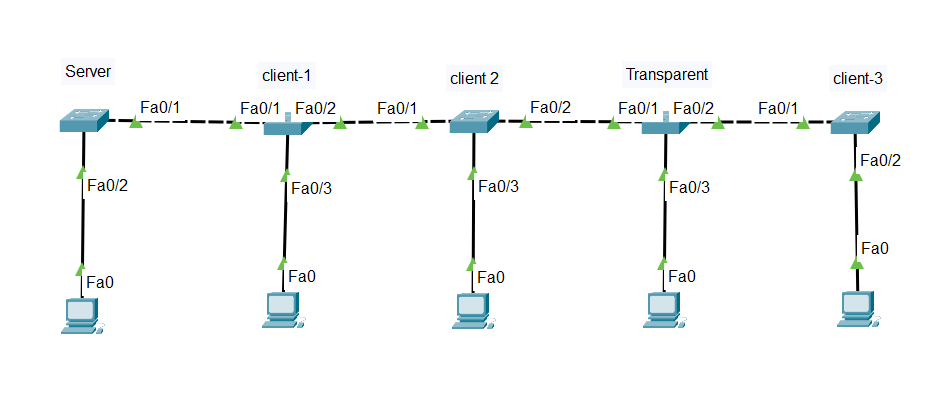

# VTP (VLAN Trunking Protocol) Lab

A Cisco Packet Tracer network simulation project demonstrating VLAN Trunking Protocol configuration and implementation.

## Overview

This project contains a complete VTP lab setup using Cisco Packet Tracer. It demonstrates how to configure VTP in a switched network environment with VTP servers and clients for efficient VLAN management across multiple switches.

## Network Topology

## Project Contents

- **VTP.pkt** - Cisco Packet Tracer simulation file with complete lab setup
- **topology.png** - Network topology diagram
- **server.png** - VTP Server configuration
- **client-1.png**, **client-2.png**, **client-3.png** - VTP Client configurations

## Lab Setup

### Devices Configured

- **VTP Server**: Central switch managing VLAN information
- **VTP Clients**: Switches receiving VLAN information from the server
- **Network Links**: Trunked connections between switches

### Key Features

✅ VTP Server configuration and management  
✅ VTP Client setup and VLAN synchronization  
✅ Trunk port configuration  
✅ VLAN propagation and verification  
✅ Network topology documentation  

## How to Use

1. Download Cisco Packet Tracer (if not already installed)
2. Open the `VTP.pkt` file in Packet Tracer
3. Review the device configurations shown in the screenshot files
4. Run simulations to observe VTP protocol behavior
5. Modify configurations and test different scenarios

## VTP Concepts Demonstrated

- **VTP Domains**: Grouped switches managing the same VLAN database
- **VTP Modes**: Server, Client, and Transparent modes
- **VLAN Synchronization**: Automatic VLAN distribution across the domain
- **Trunk Configuration**: Inter-switch links configured for VLAN trunking

## Author

Created for Cisco networking education and VTP protocol learning.

## Requirements

- Cisco Packet Tracer 8.0 or higher
- Basic understanding of VLAN and switch concepts

---

**Last Updated**: June 2026
