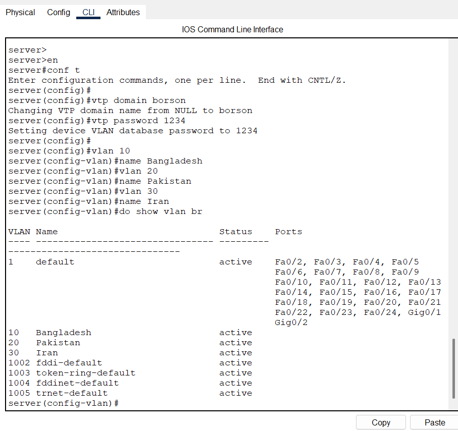
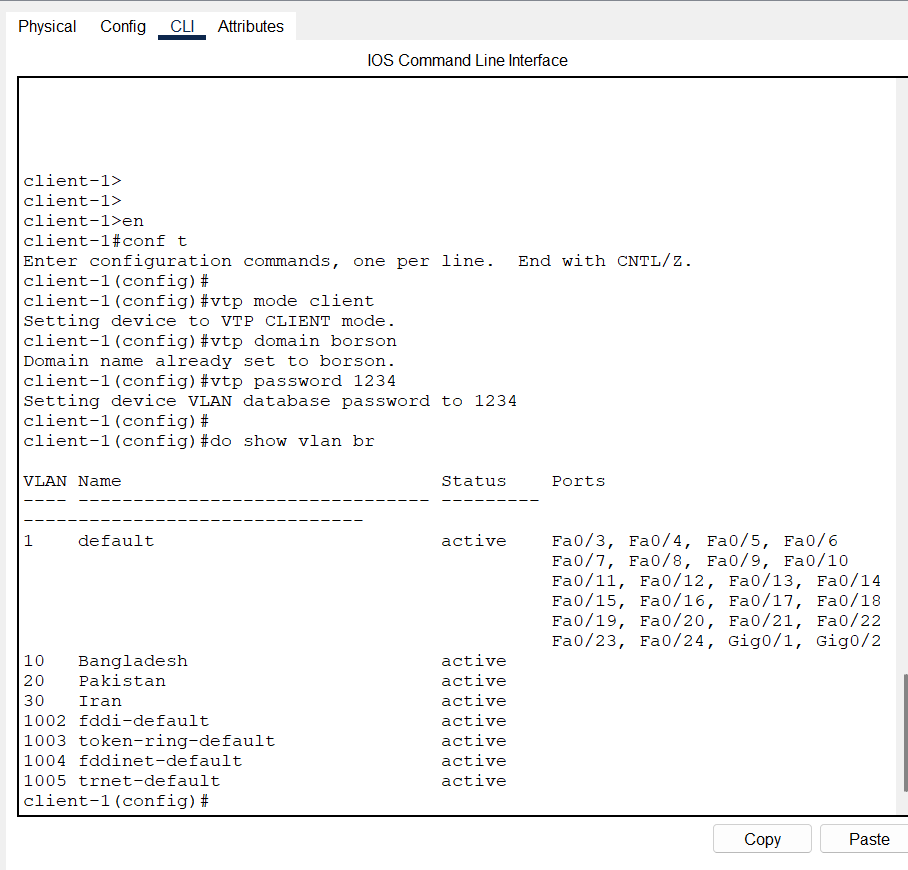
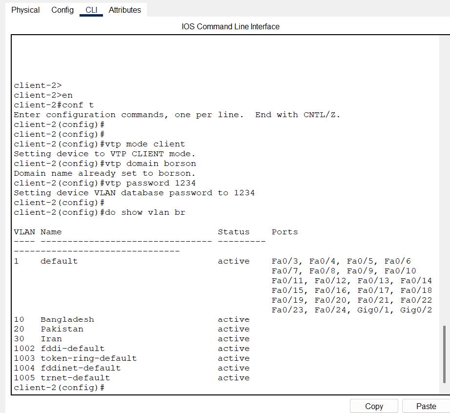
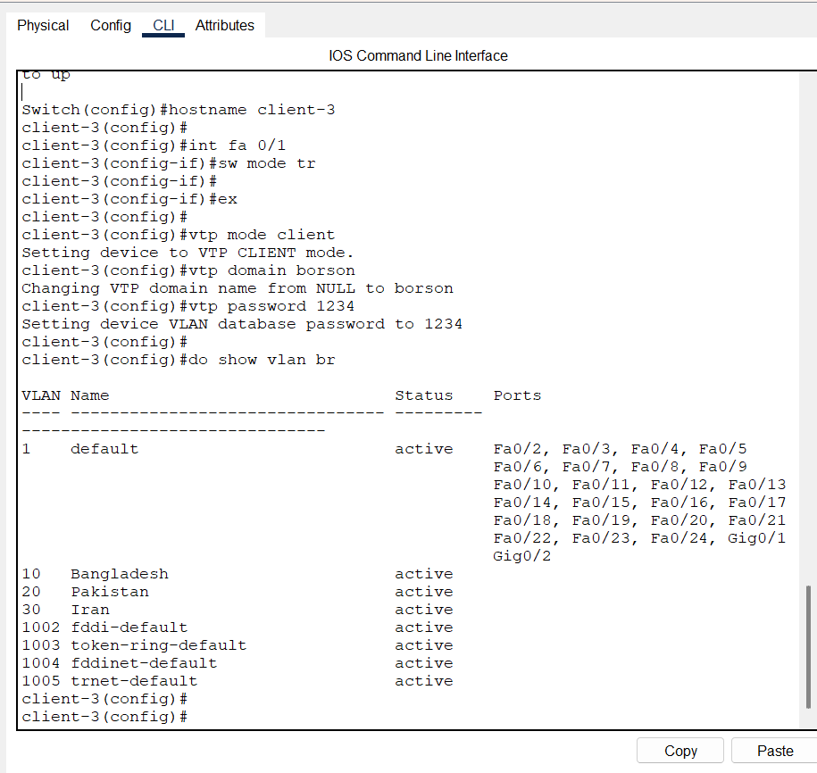
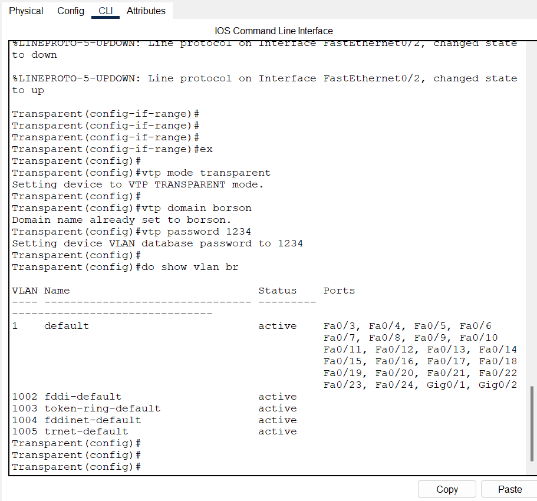

# VTP (VLAN Trunking Protocol) Lab

A Cisco Packet Tracer network simulation project demonstrating VLAN Trunking Protocol configuration and implementation.

## Overview

This project contains a complete VTP lab setup using Cisco Packet Tracer. It demonstrates how to configure VTP in a switched network environment with VTP servers and clients for efficient VLAN management across multiple switches.

## Network Topology

**Description**: Complete network topology diagram showing all switches and their interconnections for the VTP lab setup.

## Configuration Screenshots

### VTP Server Configuration

**Description**: Shows the configuration of the VTP Server switch. The VTP Server is responsible for managing and distributing VLAN information to all VTP Clients in the domain. Key configurations include:
- VTP Mode: Server
- VTP Domain Name
- VLAN Database and revision numbers
- Trunk port settings

### VTP Client 1 Configuration

**Description**: Displays the first VTP Client switch configuration. VTP Clients receive VLAN information from the VTP Server and synchronize their VLAN databases automatically. Configuration details:
- VTP Mode: Client
- Joined to the same VTP domain as the server
- Automatic VLAN synchronization enabled
- Trunk ports connecting to other switches

### VTP Client 2 Configuration

**Description**: Shows the second VTP Client switch setup. This client demonstrates VLAN propagation across multiple switches in the VTP domain with identical configuration to Client 1 but different physical location.

### VTP Client 3 Configuration

**Description**: Depicts the third VTP Client switch configuration. Multiple clients in the same VTP domain ensure redundancy and comprehensive VLAN distribution across the network infrastructure.

### VTP Transparent Mode Configuration

**Description**: Illustrates a switch configured in VTP Transparent mode. Transparent mode switches:
- Do not participate in VTP domain membership
- Forward VTP advertisements but do not synchronize VLAN databases
- Maintain their own independent VLAN database
- Useful for network segmentation and isolation

## Project Contents

- **VTP.pkt** - Cisco Packet Tracer simulation file with complete lab setup
- **topology.png** - Network topology diagram
- **server.png** - VTP Server configuration
- **client-1.png**, **client-2.png**, **client-3.png** - VTP Client configurations

## Lab Setup

### Devices Configured

- **VTP Server**: Central switch managing VLAN information
- **VTP Clients**: Switches receiving VLAN information from the server
- **Network Links**: Trunked connections between switches

### Key Features

✅ VTP Server configuration and management  
✅ VTP Client setup and VLAN synchronization  
✅ Trunk port configuration  
✅ VLAN propagation and verification  
✅ Network topology documentation  

## How to Use

1. Download Cisco Packet Tracer (if not already installed)
2. Open the `VTP.pkt` file in Packet Tracer
3. Review the device configurations shown in the screenshot files
4. Run simulations to observe VTP protocol behavior
5. Modify configurations and test different scenarios

## VTP Concepts Demonstrated

- **VTP Domains**: Grouped switches managing the same VLAN database
- **VTP Modes**: Server, Client, and Transparent modes
- **VLAN Synchronization**: Automatic VLAN distribution across the domain
- **Trunk Configuration**: Inter-switch links configured for VLAN trunking

## Author

Created for Cisco networking education and VTP protocol learning.

## Requirements

- Cisco Packet Tracer 8.0 or higher
- Basic understanding of VLAN and switch concepts

---

**Last Updated**: June 2026
